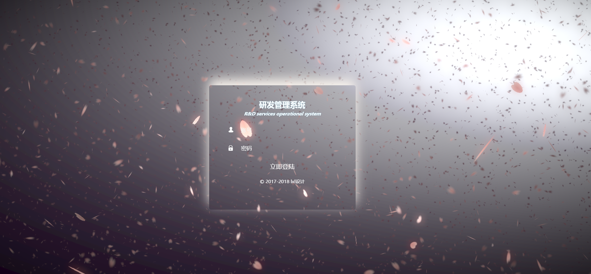
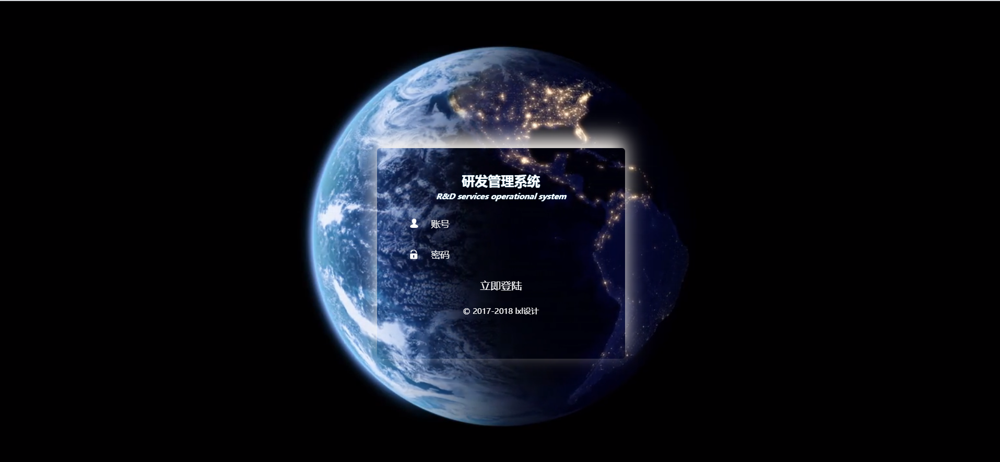
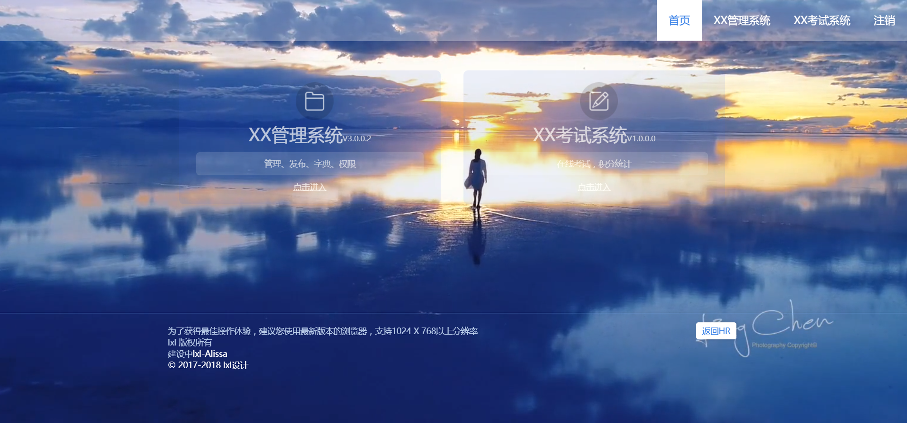
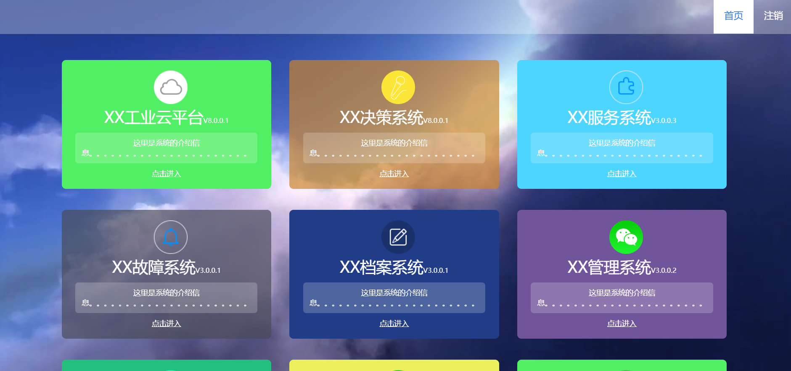

# lxling
前端大气动态效果设计，动态背景风格设计

# 前言
最近关注了[DJI大疆社区](https://bbs.dji.com/)，看了不少大神的高端视频作品，特别是大神LingChen的作品，很是喜欢。
[LingChen天空之城作品](https://bbs.dji.com/thread-166510-1-1.html)，[LingChen微博作品](https://weibo.com/u/1768614212?refer_flag=1005050010_)。
于是自己就做了个类似Lingchen这种效果的前端，很是大气，现将效果贴出来。
> 如果没有动态效果，请刷新，mov视频加载可能与网络有关，建议不要使用老的IE内核浏览器，如IE8,360等，请使用最新浏览器。

* canvas自定义js登录界面1

* vidbacking.js登录界面2

* vidbacking.js主界面1

* vidbacking.js主界面2
